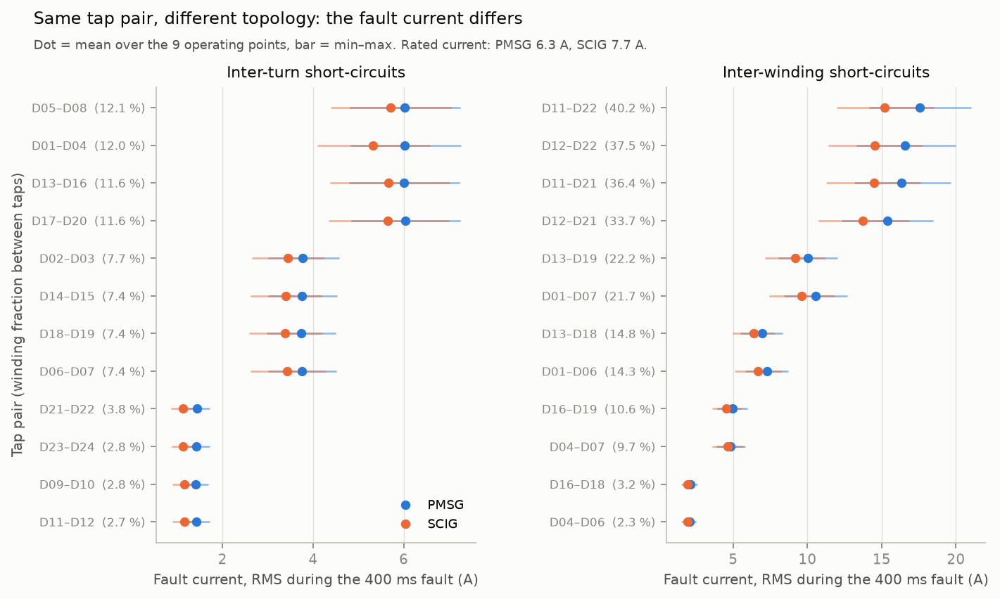
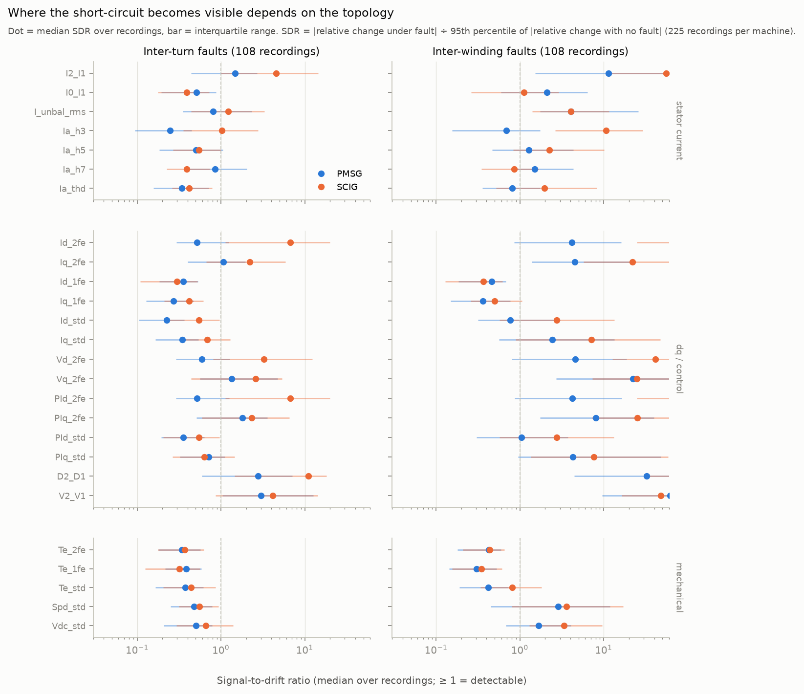
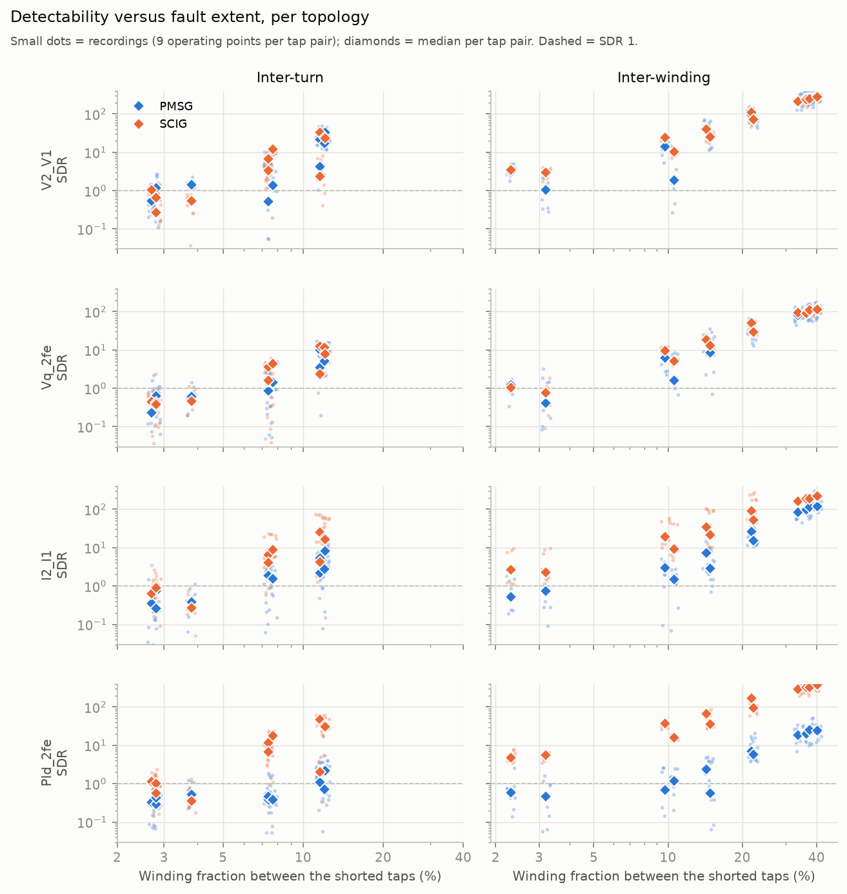
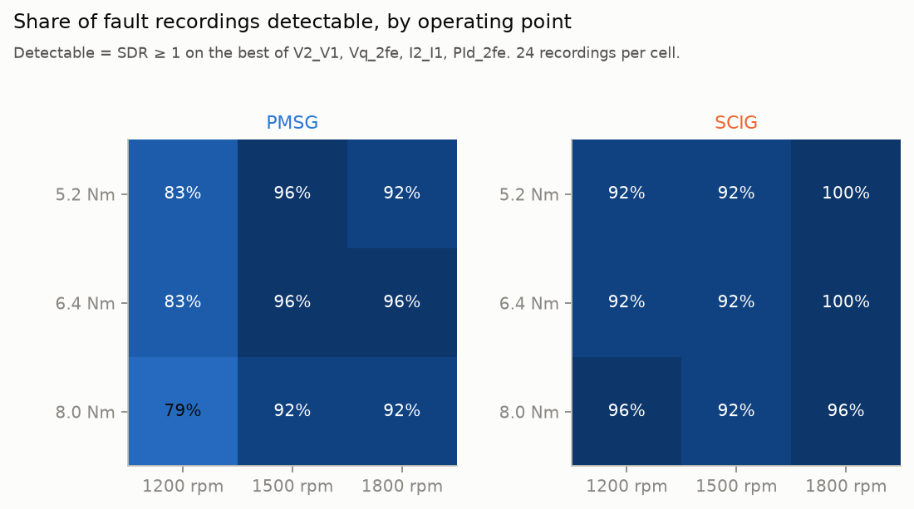
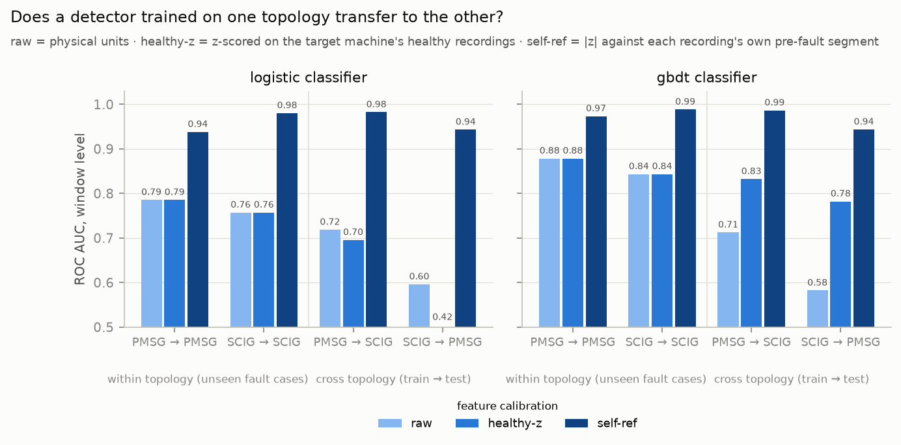

# PMSG vs SCIG under identical winding short-circuits — first comparison

Recordings: 225 per machine (24 fault cases + healthy, × 3 speeds × 3 torques). Windows of 5 electrical cycles, hop 1 cycle. PRE-early = 0.30–0.62 s, PRE-late = 0.62–0.98 s, FLT = relay-on + 30 ms to relay-off − 10 ms. Features use only stator-side / controller signals; `Ifault` and `Fault_relay` are ground truth.

**Detectability statistic.** Signal-to-drift ratio SDR = |relative change of a feature between PRE-late and FLT| ÷ 95th percentile of |relative change between PRE-early and PRE-late| over all 225 recordings of that machine. SDR ≥ 1 means the change under fault exceeds what ordinary within-recording drift produces in 95 % of healthy segments, i.e. detectable at ≈5 % per-recording false alarm. It is scale-free and directly comparable across features, operating points and topologies.

**Caveat on every number:** one physical machine per topology, no repeated tests. Differences between the two columns are differences between *these two machines*; attributing them to topology needs the simulation populations planned for the paper.

## A. Same tap pair ≠ same physical severity

Mean fault current over the 24 cases: PMSG 6.64 A, SCIG 5.97 A (SCIG/PMSG median 0.91, range 0.78–0.96). In per-unit of rated current: PMSG 1.05, SCIG 0.78. Relative to the pre-fault stator current I1: PMSG 1.86, SCIG 0.80 — the SCIG's magnetising current makes the same fault a much smaller fraction of what the stator sensors see.

| case | sev_pct | phases | Ifault_A_PMSG | Ifault_A_SCIG | ratio_SCIG_over_PMSG | Ifault_over_I1_PMSG | Ifault_over_I1_SCIG |
|---|---|---|---|---|---|---|---|
| TURNS_D11_D12 | 2.700 | AA | 1.428 | 1.161 | 0.813 | 0.396 | 0.155 |
| TURNS_D09_D10 | 2.800 | AA | 1.415 | 1.161 | 0.821 | 0.394 | 0.155 |
| TURNS_D23_D24 | 2.800 | AA | 1.425 | 1.134 | 0.796 | 0.399 | 0.151 |
| TURNS_D21_D22 | 3.800 | AA | 1.436 | 1.125 | 0.783 | 0.402 | 0.150 |
| TURNS_D06_D07 | 7.400 | AA | 3.755 | 3.426 | 0.913 | 1.055 | 0.456 |
| TURNS_D14_D15 | 7.400 | BB | 3.758 | 3.399 | 0.905 | 1.057 | 0.453 |
| TURNS_D18_D19 | 7.400 | AA | 3.744 | 3.383 | 0.904 | 1.049 | 0.451 |
| TURNS_D02_D03 | 7.690 | BB | 3.772 | 3.444 | 0.913 | 1.059 | 0.460 |
| TURNS_D17_D20 | 11.600 | CC | 6.040 | 5.654 | 0.936 | 1.703 | 0.754 |
| TURNS_D13_D16 | 11.600 | AA | 6.011 | 5.664 | 0.942 | 1.695 | 0.756 |
| TURNS_D01_D04 | 12.040 | AA | 6.016 | 5.328 | 0.886 | 1.708 | 0.711 |
| TURNS_D05_D08 | 12.100 | CC | 6.016 | 5.716 | 0.950 | 1.693 | 0.762 |
| WINDINGS_D04_D06 | 2.300 | AA | 2.062 | 1.941 | 0.941 | 0.578 | 0.258 |
| WINDINGS_D16_D18 | 3.200 | AA | 2.140 | 1.933 | 0.903 | 0.591 | 0.257 |
| WINDINGS_D04_D07 | 9.700 | AA | 4.816 | 4.620 | 0.959 | 1.329 | 0.615 |
| WINDINGS_D16_D19 | 10.600 | AA | 4.956 | 4.548 | 0.918 | 1.367 | 0.605 |
| WINDINGS_D01_D06 | 14.340 | AA | 7.268 | 6.667 | 0.917 | 2.049 | 0.889 |
| WINDINGS_D13_D18 | 14.800 | AA | 6.934 | 6.367 | 0.918 | 1.938 | 0.850 |
| WINDINGS_D01_D07 | 21.740 | AA | 10.535 | 9.590 | 0.910 | 2.956 | 1.281 |
| WINDINGS_D13_D19 | 22.200 | AA | 10.010 | 9.158 | 0.915 | 2.805 | 1.221 |
| WINDINGS_D12_D21 | 33.700 | AA | 15.388 | 13.722 | 0.892 | 4.301 | 1.832 |
| WINDINGS_D11_D21 | 36.400 | AA | 16.350 | 14.466 | 0.885 | 4.536 | 1.931 |
| WINDINGS_D12_D22 | 37.500 | AA | 16.558 | 14.521 | 0.877 | 4.598 | 1.938 |
| WINDINGS_D11_D22 | 40.200 | AA | 17.558 | 15.215 | 0.867 | 4.905 | 2.031 |

## B. Where the signature shows up, per topology

Null (95th percentile of |no-fault relative change|) per machine, selected features:

| feature | PMSG | SCIG |
|---|---|---|
| I2_I1 | 0.162 | 0.034 |
| V2_V1 | 0.086 | 0.033 |
| Id_2fe | 0.563 | 0.016 |
| Iq_2fe | 0.184 | 0.060 |
| PIq_2fe | 0.100 | 0.053 |
| Vq_2fe | 0.165 | 0.060 |
| Ia_h3 | 0.216 | 0.035 |
| Te_2fe | 0.649 | 0.625 |
| Vdc_std | 0.003 | 0.004 |

Top-6 features by median SDR per machine and fault type (`median_delta` = median relative change, sign = direction):

| machine | ftype | feature | group | median_sdr | frac_detectable | healthy_false_alarm | median_delta |
|---|---|---|---|---|---|---|---|
| SCIG | WINDINGS | D2_D1 | dq / control | 84.887 | 1.000 | 0.444 | 0.854 |
| SCIG | WINDINGS | PId_2fe | dq / control | 74.013 | 1.000 | 0.111 | 1.188 |
| SCIG | WINDINGS | Id_2fe | dq / control | 73.971 | 1.000 | 0.111 | 1.188 |
| PMSG | WINDINGS | V2_V1 | dq / control | 61.898 | 0.944 | 0.111 | 5.318 |
| SCIG | WINDINGS | I2_I1 | stator current | 55.608 | 1.000 | 0.111 | 1.869 |
| SCIG | WINDINGS | V2_V1 | dq / control | 48.192 | 1.000 | 0.000 | 1.569 |
| SCIG | WINDINGS | Vd_2fe | dq / control | 41.389 | 1.000 | 0.000 | 1.693 |
| PMSG | WINDINGS | D2_D1 | dq / control | 32.629 | 0.898 | 0.000 | 2.942 |
| PMSG | WINDINGS | Vq_2fe | dq / control | 22.398 | 0.898 | 0.000 | 3.688 |
| PMSG | WINDINGS | I2_I1 | stator current | 11.316 | 0.815 | 0.000 | 1.833 |
| SCIG | TURNS | D2_D1 | dq / control | 11.062 | 0.815 | 0.444 | 0.017 |
| PMSG | WINDINGS | PIq_2fe | dq / control | 8.002 | 0.833 | 0.111 | 0.636 |
| SCIG | TURNS | PId_2fe | dq / control | 6.685 | 0.778 | 0.111 | 0.015 |
| SCIG | TURNS | Id_2fe | dq / control | 6.682 | 0.787 | 0.111 | 0.015 |
| PMSG | WINDINGS | Vd_2fe | dq / control | 4.600 | 0.722 | 0.000 | 3.062 |
| SCIG | TURNS | I2_I1 | stator current | 4.525 | 0.750 | 0.111 | 0.042 |
| SCIG | TURNS | V2_V1 | dq / control | 4.171 | 0.731 | 0.000 | 0.026 |
| SCIG | TURNS | Vd_2fe | dq / control | 3.252 | 0.694 | 0.000 | 0.016 |
| PMSG | TURNS | V2_V1 | dq / control | 2.990 | 0.759 | 0.111 | 0.003 |
| PMSG | TURNS | D2_D1 | dq / control | 2.779 | 0.639 | 0.000 | 0.010 |
| PMSG | TURNS | PIq_2fe | dq / control | 1.802 | 0.630 | 0.111 | -0.028 |
| PMSG | TURNS | I2_I1 | stator current | 1.471 | 0.565 | 0.000 | -0.003 |
| PMSG | TURNS | Vq_2fe | dq / control | 1.346 | 0.574 | 0.000 | 0.020 |
| PMSG | TURNS | Iq_2fe | dq / control | 1.072 | 0.528 | 0.000 | -0.012 |

Share of fault recordings in which each signal group holds the strongest signature:

| machine | ftype | group | share_of_recordings_where_group_is_strongest |
|---|---|---|---|
| PMSG | TURNS | stator current | 0.102 |
| PMSG | TURNS | dq / control | 0.833 |
| PMSG | TURNS | mechanical | 0.065 |
| PMSG | WINDINGS | stator current | 0.056 |
| PMSG | WINDINGS | dq / control | 0.944 |
| PMSG | WINDINGS | mechanical | 0.000 |
| SCIG | TURNS | stator current | 0.278 |
| SCIG | TURNS | dq / control | 0.676 |
| SCIG | TURNS | mechanical | 0.046 |
| SCIG | WINDINGS | stator current | 0.333 |
| SCIG | WINDINGS | dq / control | 0.667 |
| SCIG | WINDINGS | mechanical | 0.000 |

## C. Minimum detectable fault extent

Features with the highest pooled median SDR (both machines): V2_V1, Vq_2fe, I2_I1, PId_2fe. Smallest tap-pair severity level whose median SDR is ≥ 1:

| machine | ftype | feature | min_detectable_sev_pct | n_sev_levels | n_levels_detectable | spearman_sdr_vs_sev |
|---|---|---|---|---|---|---|
| PMSG | TURNS | V2_V1 | 2.800 | 11 | 8 | 0.807 |
| PMSG | TURNS | Vq_2fe | 7.400 | 11 | 6 | 0.763 |
| PMSG | TURNS | I2_I1 | 7.400 | 11 | 7 | 0.691 |
| PMSG | TURNS | PId_2fe | 11.600 | 11 | 3 | 0.511 |
| PMSG | WINDINGS | V2_V1 | 2.300 | 12 | 12 | 0.925 |
| PMSG | WINDINGS | Vq_2fe | 2.300 | 12 | 11 | 0.910 |
| PMSG | WINDINGS | I2_I1 | 9.700 | 12 | 10 | 0.919 |
| PMSG | WINDINGS | PId_2fe | 10.600 | 12 | 8 | 0.867 |
| SCIG | TURNS | V2_V1 | 2.700 | 11 | 8 | 0.787 |
| SCIG | TURNS | Vq_2fe | 7.400 | 11 | 7 | 0.745 |
| SCIG | TURNS | I2_I1 | 2.800 | 11 | 8 | 0.729 |
| SCIG | TURNS | PId_2fe | 2.700 | 11 | 9 | 0.759 |
| SCIG | WINDINGS | V2_V1 | 2.300 | 12 | 12 | 0.947 |
| SCIG | WINDINGS | Vq_2fe | 2.300 | 12 | 11 | 0.952 |
| SCIG | WINDINGS | I2_I1 | 2.300 | 12 | 12 | 0.868 |
| SCIG | WINDINGS | PId_2fe | 2.300 | 12 | 12 | 0.935 |

## D. Operating-point dependence

| machine | speed_rpm | torque_Nm | median_best_sdr | frac_detectable |
|---|---|---|---|---|
| PMSG | 1200 | 5.200 | 7.896 | 0.833 |
| PMSG | 1200 | 6.400 | 9.006 | 0.833 |
| PMSG | 1200 | 8.000 | 5.301 | 0.792 |
| PMSG | 1500 | 5.200 | 12.826 | 0.958 |
| PMSG | 1500 | 6.400 | 11.252 | 0.958 |
| PMSG | 1500 | 8.000 | 9.580 | 0.917 |
| PMSG | 1800 | 5.200 | 20.477 | 0.917 |
| PMSG | 1800 | 6.400 | 18.200 | 0.958 |
| PMSG | 1800 | 8.000 | 15.458 | 0.917 |
| SCIG | 1200 | 5.200 | 18.149 | 0.917 |
| SCIG | 1200 | 6.400 | 16.580 | 0.917 |
| SCIG | 1200 | 8.000 | 16.052 | 0.958 |
| SCIG | 1500 | 5.200 | 26.429 | 0.917 |
| SCIG | 1500 | 6.400 | 23.491 | 0.917 |
| SCIG | 1500 | 8.000 | 23.812 | 0.917 |
| SCIG | 1800 | 5.200 | 51.011 | 1.000 |
| SCIG | 1800 | 6.400 | 47.169 | 1.000 |
| SCIG | 1800 | 8.000 | 44.012 | 0.958 |

## E. Cross-topology transfer

Window-level detector (1 = fault window of a fault recording; 0 = pre-fault windows of all recordings and fault-time windows of healthy recordings). n windows = 19345; positives = 5882. Within-topology rows use 5-fold GroupKFold over fault cases (unseen tap pairs).

| calibration | model | train | test | setting | auc | tpr_at_1pct_fpr | n_test |
|---|---|---|---|---|---|---|---|
| raw | logistic | PMSG | PMSG | within (unseen cases) | 0.785 | 0.564 | 9775 |
| raw | logistic | SCIG | SCIG | within (unseen cases) | 0.757 | 0.556 | 9570 |
| raw | logistic | PMSG | SCIG | cross-topology | 0.719 | 0.381 | 9570 |
| raw | logistic | SCIG | PMSG | cross-topology | 0.596 | 0.249 | 9775 |
| raw | gbdt | PMSG | PMSG | within (unseen cases) | 0.879 | 0.614 | 9775 |
| raw | gbdt | SCIG | SCIG | within (unseen cases) | 0.843 | 0.600 | 9570 |
| raw | gbdt | PMSG | SCIG | cross-topology | 0.713 | 0.395 | 9570 |
| raw | gbdt | SCIG | PMSG | cross-topology | 0.582 | 0.289 | 9775 |
| healthy-z | logistic | PMSG | PMSG | within (unseen cases) | 0.785 | 0.564 | 9775 |
| healthy-z | logistic | SCIG | SCIG | within (unseen cases) | 0.757 | 0.556 | 9570 |
| healthy-z | logistic | PMSG | SCIG | cross-topology | 0.696 | 0.426 | 9570 |
| healthy-z | logistic | SCIG | PMSG | cross-topology | 0.425 | 0.098 | 9775 |
| healthy-z | gbdt | PMSG | PMSG | within (unseen cases) | 0.879 | 0.614 | 9775 |
| healthy-z | gbdt | SCIG | SCIG | within (unseen cases) | 0.843 | 0.600 | 9570 |
| healthy-z | gbdt | PMSG | SCIG | cross-topology | 0.832 | 0.356 | 9570 |
| healthy-z | gbdt | SCIG | PMSG | cross-topology | 0.782 | 0.495 | 9775 |
| self-ref | logistic | PMSG | PMSG | within (unseen cases) | 0.938 | 0.777 | 9775 |
| self-ref | logistic | SCIG | SCIG | within (unseen cases) | 0.980 | 0.855 | 9570 |
| self-ref | logistic | PMSG | SCIG | cross-topology | 0.982 | 0.908 | 9570 |
| self-ref | logistic | SCIG | PMSG | cross-topology | 0.943 | 0.723 | 9775 |
| self-ref | gbdt | PMSG | PMSG | within (unseen cases) | 0.973 | 0.870 | 9775 |
| self-ref | gbdt | SCIG | SCIG | within (unseen cases) | 0.988 | 0.923 | 9570 |
| self-ref | gbdt | PMSG | SCIG | cross-topology | 0.987 | 0.917 | 9570 |
| self-ref | gbdt | SCIG | PMSG | cross-topology | 0.944 | 0.740 | 9775 |

Cosine similarity of the two logistic weight vectors (healthy-z features), PMSG vs SCIG: **0.06** (1 = identical feature weighting).

Largest-weight features (healthy-z logistic):

| feature | PMSG | SCIG | abs_mean |
|---|---|---|---|
| PIq_2fe | -2.779 | 3.190 | 2.985 |
| I2_I1 | 1.045 | 4.885 | 2.965 |
| V2_V1 | 5.660 | -0.063 | 2.862 |
| D2_D1 | 2.447 | 0.889 | 1.668 |
| Vq_2fe | 2.945 | 0.208 | 1.577 |
| Ia_h3 | 2.021 | 1.099 | 1.560 |
| Vd_2fe | 1.770 | 1.089 | 1.430 |
| Iq_std | -0.257 | -2.207 | 1.232 |
| Iq_2fe | 0.224 | 2.112 | 1.168 |
| I0_I1 | 0.794 | -1.288 | 1.041 |
| I_unbal_rms | -1.225 | -0.612 | 0.918 |
| Spd_std | 0.707 | 0.859 | 0.783 |

