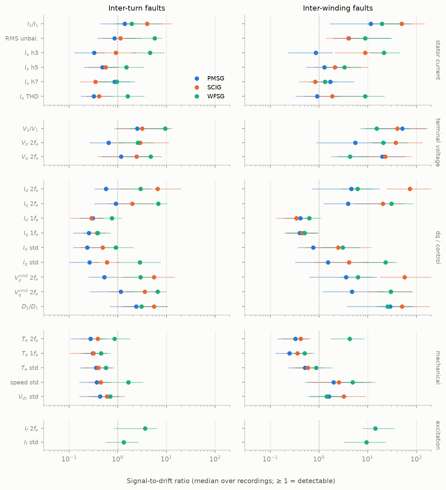
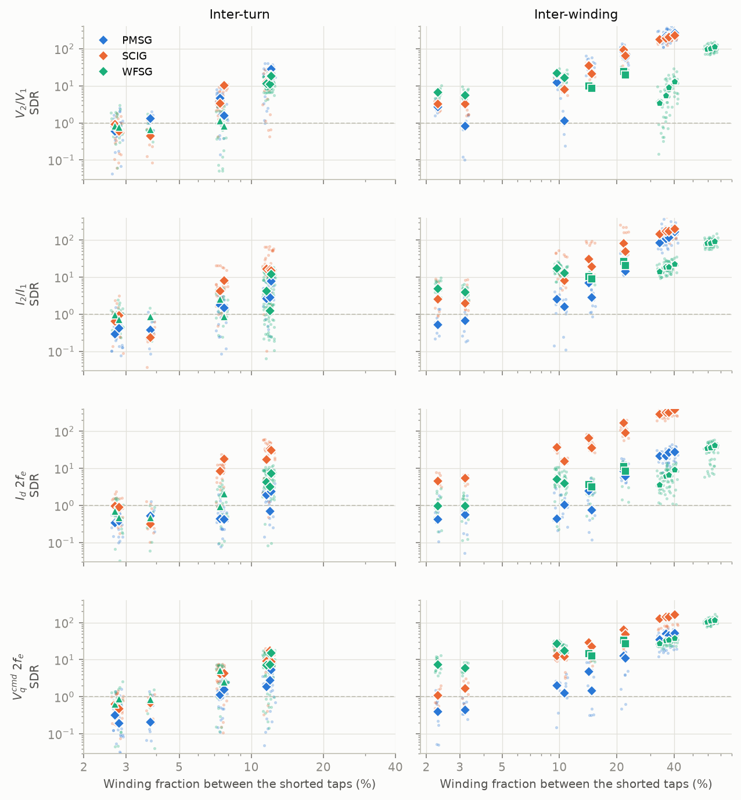
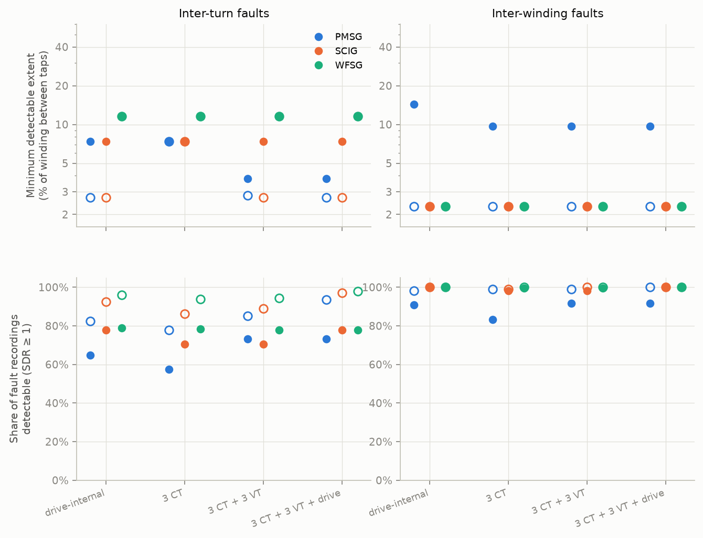
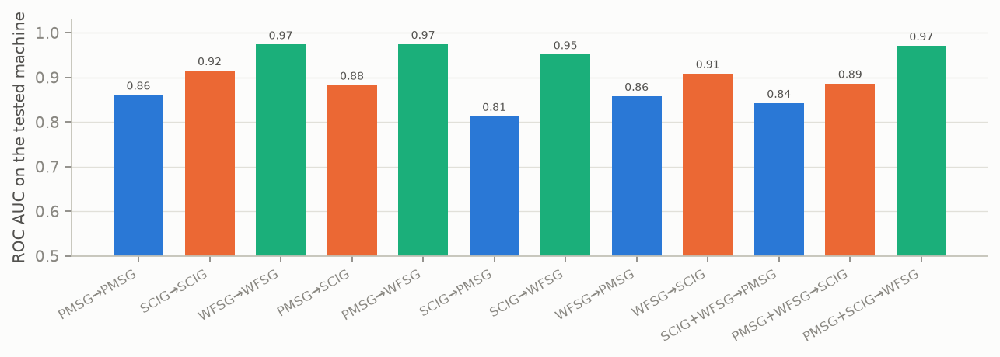

# Three alternatives: PMSG, SCIG, WFSG (3-cycle windows, common features)

Recordings: {'PMSG': 225, 'SCIG': 225, 'WFSG': 438}; WFSG at all fault impedances (coverage: {('TURNS', 1.0): 63, ('TURNS', 2.83): 117, ('WINDINGS', 2.83): 81, ('WINDINGS', 5.66): 36, ('WINDINGS', 11.32): 141}).

## Null (95th percentile of |no-fault relative change|)

| feature | PMSG | SCIG | WFSG |
|---|---|---|---|
| V2_V1 | 0.095 | 0.037 | 0.037 |
| I2_I1 | 0.160 | 0.036 | 0.082 |
| Id_2fe | 0.444 | 0.015 | 0.168 |
| Vqconv_2fe | 0.166 | 0.038 | 0.091 |
| If_2fe |  |  | 0.339 |

## Fault current per tap pair (median over recordings)

| ('case', '') | ('ftype', '') | ('sev_pct', '') | ('Ifault_A', 'PMSG') | ('Ifault_A', 'SCIG') | ('Ifault_A', 'WFSG') | ('Ifault_over_I1', 'PMSG') | ('Ifault_over_I1', 'SCIG') | ('Ifault_over_I1', 'WFSG') |
|---|---|---|---|---|---|---|---|---|
| TURNS_D01_D04 | TURNS | 12.000 | 5.850 | 5.159 | 4.575 | 2.305 | 1.001 | 1.242 |
| TURNS_D02_D03 | TURNS | 7.700 | 3.683 | 3.370 | 3.209 | 1.454 | 0.650 | 1.008 |
| TURNS_D05_D08 | TURNS | 12.100 | 5.928 | 5.598 | 3.971 | 2.340 | 1.047 | 1.211 |
| TURNS_D06_D07 | TURNS | 7.400 | 3.673 | 3.330 | 3.275 | 1.442 | 0.637 | 0.936 |
| TURNS_D09_D10 | TURNS | 2.800 | 1.398 | 1.123 | 1.280 | 0.533 | 0.214 | 0.364 |
| TURNS_D11_D12 | TURNS | 2.700 | 1.409 | 1.131 | 1.277 | 0.549 | 0.215 | 0.366 |
| TURNS_D13_D16 | TURNS | 11.600 | 5.872 | 5.522 | 3.898 | 2.309 | 1.056 | 1.180 |
| TURNS_D14_D15 | TURNS | 7.400 | 3.698 | 3.286 | 4.128 | 1.456 | 0.623 | 1.316 |
| TURNS_D17_D20 | TURNS | 11.600 | 5.904 | 5.546 | 3.879 | 2.338 | 1.056 | 1.180 |
| TURNS_D18_D19 | TURNS | 7.400 | 3.674 | 3.307 | 3.211 | 1.438 | 0.630 | 1.031 |
| TURNS_D21_D22 | TURNS | 3.800 | 1.414 | 1.087 | 1.298 | 0.553 | 0.204 | 0.365 |
| TURNS_D23_D24 | TURNS | 2.800 | 1.406 | 1.087 | 1.282 | 0.556 | 0.203 | 0.364 |
| WINDINGS_D01_D06 | WINDINGS | 14.300 | 7.113 | 6.478 | 3.330 | 2.831 | 1.233 | 1.057 |
| WINDINGS_D01_D07 | WINDINGS | 21.700 | 10.352 | 9.469 | 4.734 | 4.064 | 1.803 | 1.514 |
| WINDINGS_D04_D06 | WINDINGS | 2.300 | 2.003 | 1.908 | 2.394 | 0.778 | 0.362 | 0.974 |
| WINDINGS_D04_D07 | WINDINGS | 9.700 | 4.699 | 4.507 | 4.197 | 1.819 | 0.855 | 1.297 |
| WINDINGS_D09_D23 | WINDINGS | 62.500 |  |  | 4.991 |  |  | 1.611 |
| WINDINGS_D09_D24 | WINDINGS | 65.300 |  |  | 5.195 |  |  | 1.679 |
| WINDINGS_D10_D23 | WINDINGS | 59.700 |  |  | 4.923 |  |  | 1.591 |
| WINDINGS_D10_D24 | WINDINGS | 62.500 |  |  | 4.965 |  |  | 1.555 |
| WINDINGS_D11_D21 | WINDINGS | 36.400 | 16.010 | 14.225 | 3.114 | 6.174 | 2.678 | 0.992 |
| WINDINGS_D11_D22 | WINDINGS | 40.200 | 17.111 | 14.910 | 3.340 | 6.656 | 2.839 | 1.061 |
| WINDINGS_D12_D21 | WINDINGS | 33.700 | 15.158 | 13.373 | 2.888 | 5.927 | 2.551 | 0.919 |
| WINDINGS_D12_D22 | WINDINGS | 37.500 | 16.190 | 14.179 | 3.114 | 6.380 | 2.705 | 0.988 |
| WINDINGS_D13_D18 | WINDINGS | 14.800 | 6.828 | 6.279 | 2.573 | 2.656 | 1.193 | 0.837 |
| WINDINGS_D13_D19 | WINDINGS | 22.200 | 9.812 | 8.928 | 3.833 | 3.838 | 1.712 | 1.237 |
| WINDINGS_D16_D18 | WINDINGS | 3.200 | 2.096 | 1.902 | 1.997 | 0.823 | 0.363 | 0.741 |
| WINDINGS_D16_D19 | WINDINGS | 10.600 | 4.884 | 4.422 | 2.912 | 1.886 | 0.836 | 1.093 |

## Per-feature SDR (top 6 per machine and fault type)

| machine | ftype | feature | group | n | median_sdr | frac_detectable | healthy_false_alarm |
|---|---|---|---|---|---|---|---|
| SCIG | WINDINGS | Id_2fe | dq / control | 108 | 73.008 | 1.000 | 0.222 |
| SCIG | WINDINGS | Vdconv_2fe | dq / control | 108 | 57.302 | 1.000 | 0.111 |
| PMSG | WINDINGS | V2_V1 | terminal voltage | 108 | 51.480 | 0.917 | 0.222 |
| SCIG | WINDINGS | D2_D1 | dq / control | 108 | 50.729 | 1.000 | 0.333 |
| SCIG | WINDINGS | I2_I1 | stator current | 108 | 49.515 | 0.981 | 0.000 |
| SCIG | WINDINGS | V2_V1 | terminal voltage | 108 | 40.673 | 1.000 | 0.222 |
| SCIG | WINDINGS | Vd_2fe | terminal voltage | 108 | 37.398 | 1.000 | 0.000 |
| WFSG | WINDINGS | Iq_2fe | dq / control | 258 | 30.885 | 1.000 |  |
| WFSG | WINDINGS | Vqconv_2fe | dq / control | 258 | 29.750 | 1.000 |  |
| PMSG | WINDINGS | D2_D1 | dq / control | 108 | 28.714 | 0.907 | 0.000 |
| WFSG | WINDINGS | D2_D1 | dq / control | 258 | 25.668 | 1.000 |  |
| WFSG | WINDINGS | Iq_std | dq / control | 258 | 23.068 | 0.953 |  |
| WFSG | WINDINGS | Ia_h3 | stator current | 258 | 21.312 | 0.996 |  |
| WFSG | WINDINGS | Vd_2fe | terminal voltage | 258 | 20.709 | 0.996 |  |
| PMSG | WINDINGS | Vq_2fe | terminal voltage | 108 | 19.760 | 0.889 | 0.000 |
| PMSG | WINDINGS | I2_I1 | stator current | 108 | 11.539 | 0.833 | 0.000 |
| WFSG | TURNS | V2_V1 | terminal voltage | 176 | 9.359 | 0.795 |  |
| WFSG | TURNS | Iq_2fe | dq / control | 176 | 6.808 | 0.807 |  |
| WFSG | TURNS | Vqconv_2fe | dq / control | 176 | 6.590 | 0.801 |  |
| SCIG | TURNS | Id_2fe | dq / control | 108 | 6.525 | 0.778 | 0.222 |
| WFSG | TURNS | I_unbal_rms | stator current | 176 | 5.737 | 0.801 |  |
| PMSG | WINDINGS | Vd_2fe | terminal voltage | 108 | 5.566 | 0.713 | 0.000 |
| SCIG | TURNS | Vdconv_2fe | dq / control | 108 | 5.538 | 0.731 | 0.111 |
| SCIG | TURNS | D2_D1 | dq / control | 108 | 5.482 | 0.778 | 0.333 |
| PMSG | WINDINGS | Vqconv_2fe | dq / control | 108 | 4.762 | 0.759 | 0.000 |
| WFSG | TURNS | Vq_2fe | terminal voltage | 176 | 4.724 | 0.807 |  |
| WFSG | TURNS | Ia_h3 | stator current | 176 | 4.606 | 0.824 |  |
| SCIG | TURNS | I2_I1 | stator current | 108 | 3.990 | 0.704 | 0.000 |
| SCIG | TURNS | Vqconv_2fe | dq / control | 108 | 3.574 | 0.657 | 0.222 |
| SCIG | TURNS | V2_V1 | terminal voltage | 108 | 3.134 | 0.694 | 0.222 |
| PMSG | TURNS | V2_V1 | terminal voltage | 108 | 2.495 | 0.731 | 0.222 |
| PMSG | TURNS | D2_D1 | dq / control | 108 | 2.370 | 0.648 | 0.000 |
| PMSG | TURNS | I2_I1 | stator current | 108 | 1.384 | 0.574 | 0.000 |
| PMSG | TURNS | Vq_2fe | terminal voltage | 108 | 1.174 | 0.546 | 0.000 |
| PMSG | TURNS | Vqconv_2fe | dq / control | 108 | 1.141 | 0.546 | 0.000 |
| PMSG | TURNS | Iq_2fe | dq / control | 108 | 0.907 | 0.463 | 0.000 |

## Sensor suites

| suite | machine | ftype | best_feature | n_trials | n_features | fixed_median_sdr | fixed_share_detectable | fixed_min_detectable_pct | fixed_min_detectable_first_pct | smallest_extent_tested_pct | oracle_share_detectable | oracle_min_detectable_pct | oracle_healthy_false_alarm |
|---|---|---|---|---|---|---|---|---|---|---|---|---|---|
| drive-internal | PMSG | TURNS | D2_D1 | 108 | 14 | 2.370 | 0.648 | 7.400 | 7.400 | 2.700 | 0.824 | 2.700 | 0.444 |
| 3 CT | PMSG | TURNS | I2_I1 | 108 | 6 | 1.384 | 0.574 | 7.400 | 7.400 | 2.700 | 0.778 | 7.400 | 0.111 |
| 3 CT + 3 VT | PMSG | TURNS | V2_V1 | 108 | 7 | 2.495 | 0.731 | 3.800 | 3.800 | 2.700 | 0.852 | 2.800 | 0.333 |
| 3 CT + 3 VT + drive | PMSG | TURNS | V2_V1 | 108 | 23 | 2.495 | 0.731 | 3.800 | 3.800 | 2.700 | 0.935 | 2.700 | 0.667 |
| drive-internal | PMSG | WINDINGS | D2_D1 | 108 | 14 | 28.714 | 0.907 | 14.300 | 2.300 | 2.300 | 0.981 | 2.300 | 0.444 |
| 3 CT | PMSG | WINDINGS | I2_I1 | 108 | 6 | 11.539 | 0.833 | 9.700 | 9.700 | 2.300 | 0.991 | 2.300 | 0.111 |
| 3 CT + 3 VT | PMSG | WINDINGS | V2_V1 | 108 | 7 | 51.480 | 0.917 | 9.700 | 2.300 | 2.300 | 0.991 | 2.300 | 0.333 |
| 3 CT + 3 VT + drive | PMSG | WINDINGS | V2_V1 | 108 | 23 | 51.480 | 0.917 | 9.700 | 2.300 | 2.300 | 1.000 | 2.300 | 0.667 |
| drive-internal | SCIG | TURNS | Id_2fe | 108 | 13 | 6.525 | 0.778 | 7.400 | 7.400 | 2.700 | 0.926 | 2.700 | 0.778 |
| 3 CT | SCIG | TURNS | I2_I1 | 108 | 6 | 3.990 | 0.704 | 7.400 | 7.400 | 2.700 | 0.861 | 7.400 | 0.556 |
| 3 CT + 3 VT | SCIG | TURNS | I2_I1 | 108 | 7 | 3.990 | 0.704 | 7.400 | 7.400 | 2.700 | 0.889 | 2.700 | 0.556 |
| 3 CT + 3 VT + drive | SCIG | TURNS | Id_2fe | 108 | 22 | 6.525 | 0.778 | 7.400 | 7.400 | 2.700 | 0.972 | 2.700 | 0.889 |
| drive-internal | SCIG | WINDINGS | Id_2fe | 108 | 13 | 73.008 | 1.000 | 2.300 | 2.300 | 2.300 | 1.000 | 2.300 | 0.778 |
| 3 CT | SCIG | WINDINGS | I2_I1 | 108 | 6 | 49.515 | 0.981 | 2.300 | 2.300 | 2.300 | 0.991 | 2.300 | 0.556 |
| 3 CT + 3 VT | SCIG | WINDINGS | I2_I1 | 108 | 7 | 49.515 | 0.981 | 2.300 | 2.300 | 2.300 | 1.000 | 2.300 | 0.556 |
| 3 CT + 3 VT + drive | SCIG | WINDINGS | Id_2fe | 108 | 22 | 73.008 | 1.000 | 2.300 | 2.300 | 2.300 | 1.000 | 2.300 | 0.889 |
| drive-internal | WFSG | TURNS | Iq_2fe | 180 | 13 | 6.808 | 0.789 | 11.600 | 11.600 | 11.600 | 0.961 | 11.600 |  |
| 3 CT | WFSG | TURNS | I_unbal_rms | 180 | 6 | 5.737 | 0.783 | 11.600 | 11.600 | 11.600 | 0.939 | 11.600 |  |
| 3 CT + 3 VT | WFSG | TURNS | V2_V1 | 180 | 7 | 9.359 | 0.778 | 11.600 | 11.600 | 11.600 | 0.944 | 11.600 |  |
| 3 CT + 3 VT + drive | WFSG | TURNS | V2_V1 | 180 | 22 | 9.359 | 0.778 | 11.600 | 11.600 | 11.600 | 0.978 | 11.600 |  |
| excitation (WFSG only) | WFSG | TURNS | If_2fe | 180 | 2 | 3.649 | 0.700 | 11.600 | 11.600 | 11.600 | 0.744 | 11.600 |  |
| drive-internal | WFSG | WINDINGS | Iq_2fe | 258 | 13 | 30.885 | 1.000 | 2.300 | 2.300 | 2.300 | 1.000 | 2.300 |  |
| 3 CT | WFSG | WINDINGS | Ia_h3 | 258 | 6 | 21.312 | 0.996 | 2.300 | 2.300 | 2.300 | 1.000 | 2.300 |  |
| 3 CT + 3 VT | WFSG | WINDINGS | Ia_h3 | 258 | 7 | 21.312 | 0.996 | 2.300 | 2.300 | 2.300 | 1.000 | 2.300 |  |
| 3 CT + 3 VT + drive | WFSG | WINDINGS | Iq_2fe | 258 | 22 | 30.885 | 1.000 | 2.300 | 2.300 | 2.300 | 1.000 | 2.300 |  |
| excitation (WFSG only) | WFSG | WINDINGS | If_2fe | 258 | 2 | 14.238 | 1.000 | 2.300 | 2.300 | 2.300 | 1.000 | 2.300 |  |

## Transfer (self-ref |z|, GBDT; 66398 windows, 8108 positives)

| train | test | auc | tpr_at_1pct_fpr |
|---|---|---|---|
| PMSG | PMSG | 0.861 | 0.630 |
| SCIG | SCIG | 0.915 | 0.765 |
| WFSG | WFSG | 0.974 | 0.929 |
| PMSG | SCIG | 0.883 | 0.618 |
| PMSG | WFSG | 0.974 | 0.903 |
| SCIG | PMSG | 0.813 | 0.363 |
| SCIG | WFSG | 0.951 | 0.869 |
| WFSG | PMSG | 0.858 | 0.533 |
| WFSG | SCIG | 0.909 | 0.621 |
| SCIG+WFSG | PMSG | 0.842 | 0.431 |
| PMSG+WFSG | SCIG | 0.886 | 0.629 |
| PMSG+SCIG | WFSG | 0.971 | 0.893 |

