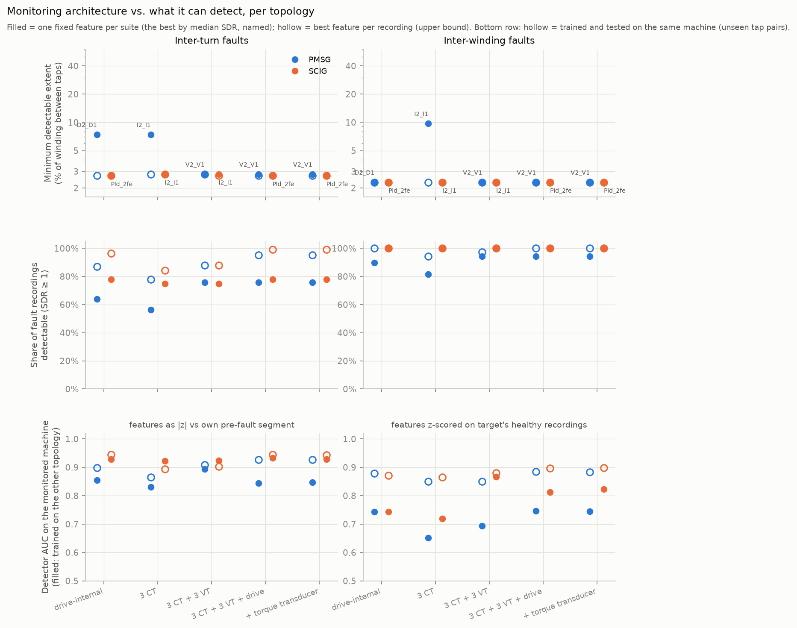

# Sensor-suite analysis — which monitoring architecture detects what, per topology

Suites, ordered by added hardware / integration:

- **drive-internal** — no added sensors; access to the converter controller (18 candidate features)
- **3 CT** — 3 current transducers at the terminals; no angle information (7 candidate features)
- **3 CT + 3 VT** — 3 current + 3 voltage transducers; no angle information (8 candidate features)
- **3 CT + 3 VT + drive** — external transducers plus controller access (dq transform of measured voltages) (28 candidate features)
- **+ torque transducer** — everything above plus a shaft torque transducer (31 candidate features)

Features that fire on more than one of the nine healthy recordings of a machine are excluded for that machine (`excluded` column). `fixed_*` = one feature per suite chosen once by median SDR; `oracle_*` = best feature per recording (upper bound for a multi-feature detector).

| suite | machine | ftype | n_features | best_feature | fixed_median_sdr | fixed_share_detectable | fixed_min_detectable_pct | oracle_share_detectable | oracle_min_detectable_pct | excluded |
|---|---|---|---|---|---|---|---|---|---|---|
| drive-internal | PMSG | TURNS | 14 | D2_D1 | 2.779 | 0.639 | 7.400 | 0.870 | 2.700 | Id_1fe,PId_std,Spd_std,Vqconv_2fe |
| 3 CT | PMSG | TURNS | 7 | I2_I1 | 1.471 | 0.565 | 7.400 | 0.778 | 2.800 |  |
| 3 CT + 3 VT | PMSG | TURNS | 8 | V2_V1 | 2.990 | 0.759 | 2.800 | 0.880 | 2.800 |  |
| 3 CT + 3 VT + drive | PMSG | TURNS | 24 | V2_V1 | 2.990 | 0.759 | 2.800 | 0.954 | 2.700 | Id_1fe,PId_std,Spd_std,Vqconv_2fe |
| + torque transducer | PMSG | TURNS | 27 | V2_V1 | 2.990 | 0.759 | 2.800 | 0.954 | 2.700 | Id_1fe,PId_std,Spd_std,Vqconv_2fe |
| drive-internal | PMSG | WINDINGS | 14 | D2_D1 | 32.629 | 0.898 | 2.300 | 1.000 | 2.300 | Id_1fe,PId_std,Spd_std,Vqconv_2fe |
| 3 CT | PMSG | WINDINGS | 7 | I2_I1 | 11.316 | 0.815 | 9.700 | 0.944 | 2.300 |  |
| 3 CT + 3 VT | PMSG | WINDINGS | 8 | V2_V1 | 61.898 | 0.944 | 2.300 | 0.972 | 2.300 |  |
| 3 CT + 3 VT + drive | PMSG | WINDINGS | 24 | V2_V1 | 61.898 | 0.944 | 2.300 | 1.000 | 2.300 | Id_1fe,PId_std,Spd_std,Vqconv_2fe |
| + torque transducer | PMSG | WINDINGS | 27 | V2_V1 | 61.898 | 0.944 | 2.300 | 1.000 | 2.300 | Id_1fe,PId_std,Spd_std,Vqconv_2fe |
| drive-internal | SCIG | TURNS | 14 | PId_2fe | 6.685 | 0.778 | 2.700 | 0.963 | 2.700 | D2_D1,Iq_2fe,Vdc_std,Vqconv_2fe |
| 3 CT | SCIG | TURNS | 5 | I2_I1 | 4.525 | 0.750 | 2.800 | 0.843 | 2.800 | Ia_h3,Ia_h7 |
| 3 CT + 3 VT | SCIG | TURNS | 6 | I2_I1 | 4.525 | 0.750 | 2.800 | 0.880 | 2.700 | Ia_h3,Ia_h7 |
| 3 CT + 3 VT + drive | SCIG | TURNS | 22 | PId_2fe | 6.685 | 0.778 | 2.700 | 0.991 | 2.700 | D2_D1,Ia_h3,Ia_h7,Iq_2fe,Vdc_std,Vqconv_2fe |
| + torque transducer | SCIG | TURNS | 25 | PId_2fe | 6.685 | 0.778 | 2.700 | 0.991 | 2.700 | D2_D1,Ia_h3,Ia_h7,Iq_2fe,Vdc_std,Vqconv_2fe |
| drive-internal | SCIG | WINDINGS | 14 | PId_2fe | 74.013 | 1.000 | 2.300 | 1.000 | 2.300 | D2_D1,Iq_2fe,Vdc_std,Vqconv_2fe |
| 3 CT | SCIG | WINDINGS | 5 | I2_I1 | 55.608 | 1.000 | 2.300 | 1.000 | 2.300 | Ia_h3,Ia_h7 |
| 3 CT + 3 VT | SCIG | WINDINGS | 6 | I2_I1 | 55.608 | 1.000 | 2.300 | 1.000 | 2.300 | Ia_h3,Ia_h7 |
| 3 CT + 3 VT + drive | SCIG | WINDINGS | 22 | PId_2fe | 74.013 | 1.000 | 2.300 | 1.000 | 2.300 | D2_D1,Ia_h3,Ia_h7,Iq_2fe,Vdc_std,Vqconv_2fe |
| + torque transducer | SCIG | WINDINGS | 25 | PId_2fe | 74.013 | 1.000 | 2.300 | 1.000 | 2.300 | D2_D1,Ia_h3,Ia_h7,Iq_2fe,Vdc_std,Vqconv_2fe |

## Transfer restricted to each suite (GBDT)

| suite | calibration | PMSG→PMSG | PMSG→SCIG | SCIG→PMSG | SCIG→SCIG |
|---|---|---|---|---|---|
| + torque transducer | healthy-z | 0.883 | 0.823 | 0.744 | 0.898 |
| + torque transducer | self-ref | 0.927 | 0.929 | 0.847 | 0.943 |
| 3 CT | healthy-z | 0.850 | 0.719 | 0.652 | 0.865 |
| 3 CT | self-ref | 0.866 | 0.923 | 0.830 | 0.893 |
| 3 CT + 3 VT | healthy-z | 0.850 | 0.867 | 0.694 | 0.880 |
| 3 CT + 3 VT | self-ref | 0.909 | 0.923 | 0.894 | 0.903 |
| 3 CT + 3 VT + drive | healthy-z | 0.885 | 0.812 | 0.746 | 0.896 |
| 3 CT + 3 VT + drive | self-ref | 0.927 | 0.932 | 0.844 | 0.944 |
| drive-internal | healthy-z | 0.878 | 0.743 | 0.743 | 0.871 |
| drive-internal | self-ref | 0.899 | 0.929 | 0.854 | 0.945 |

